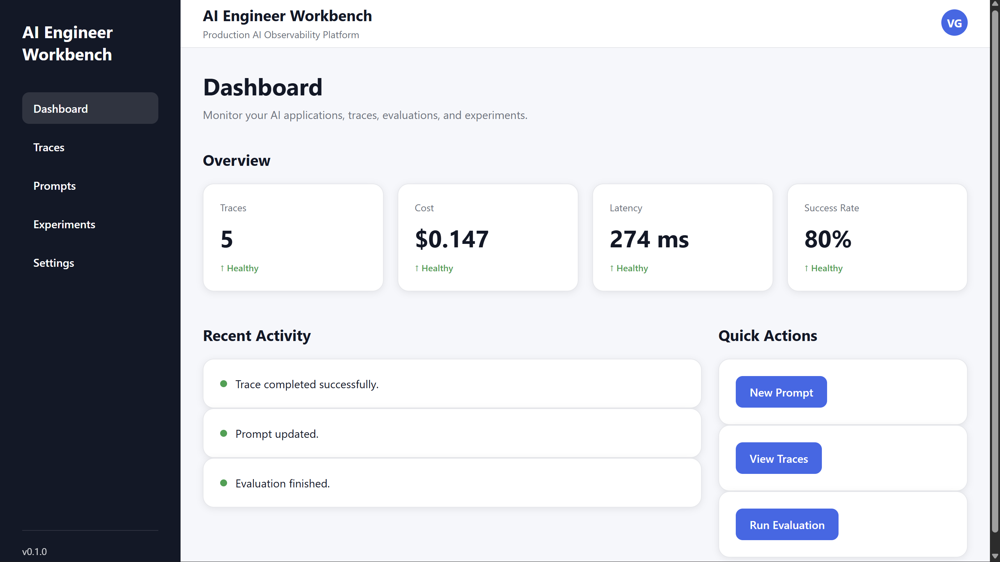
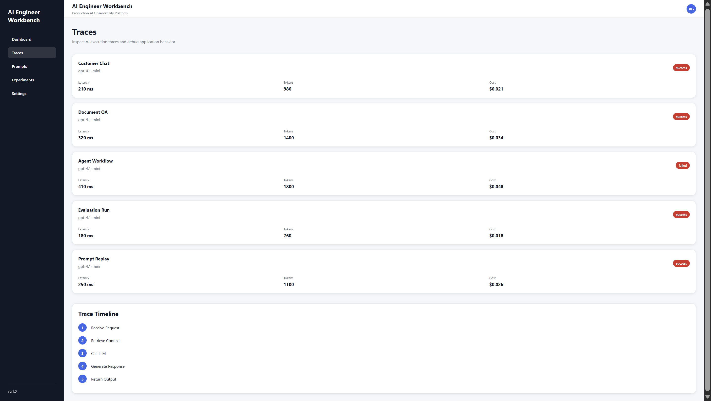
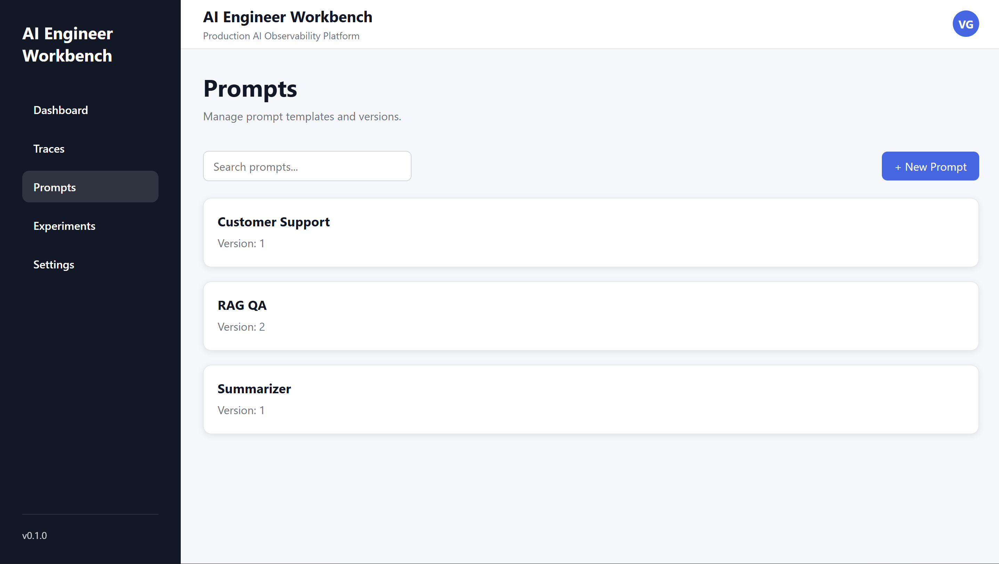
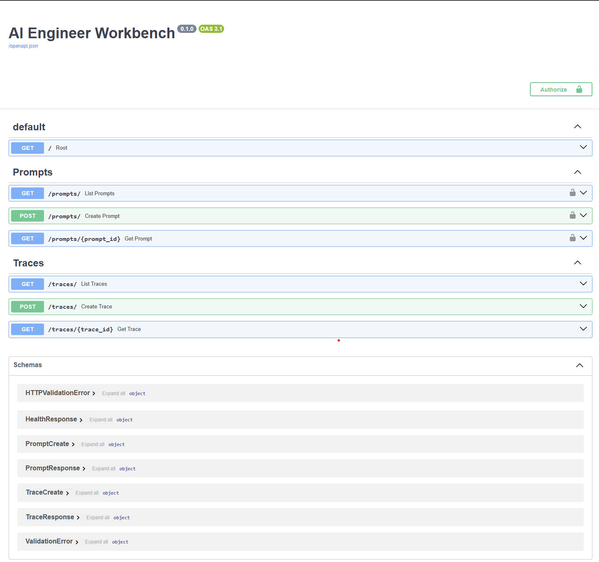

# 🚀 AI Engineer Workbench

> **Build • Observe • Debug • Evaluate Production AI Systems**

AI Engineer Workbench is an open-source observability platform for production AI systems.

It enables AI engineers to trace, monitor, debug, and evaluate Large Language Model (LLM) applications through production-grade tooling inspired by modern AI platforms such as LangSmith, Langfuse, OpenTelemetry, and Weights & Biases.

This project is being built from first principles to demonstrate production AI engineering practices, scalable system design, and modern LLM infrastructure.

---

# Project Goals

AI Engineer Workbench is designed to demonstrate how modern production AI systems are engineered.

The project focuses on:

- AI observability
- LLM tracing
- Prompt management
- Experiment tracking
- Production deployment
- REST API design
- Backend architecture
- Cloud infrastructure
- Production engineering best practices

---

## Badges


---

## Engineering Highlights

- Modular FastAPI backend architecture
- React + Vite frontend
- PostgreSQL persistence layer
- SQLAlchemy ORM
- RESTful API design
- Environment-based configuration
- Production deployment (Render + Vercel)
- GitHub Actions CI pipeline
- Docker development environment
- OpenAPI / Swagger documentation
- Production-ready project structure

---

## 🌐 Live Demo

### Frontend

https://ai-engineer-workbench.vercel.app

### Backend API

https://ai-engineer-workbench-backend.onrender.com

### API Documentation

https://ai-engineer-workbench-backend.onrender.com/docs

> The frontend is deployed on Vercel and the backend is deployed on Render with PostgreSQL persistence.

---

# Why AI Engineer Workbench?

Modern AI applications often fail silently through hallucinations, poor retrieval, unreliable agent behavior, or increasing inference costs. Traditional software observability tools cannot explain why an LLM produced an incorrect response. AI Engineer Workbench provides a unified platform for tracing, debugging, monitoring, and evaluating production AI systems, helping developers build reliable AI applications with greater confidence.

AI systems often fail silently due to:

- Hallucinations
- Incorrect reasoning
- Poor retrieval
- Agent loops
- Invalid structured outputs
- Prompt regressions
- Rising inference costs
- Limited observability

AI Engineer Workbench is designed to make these failures observable and debuggable.

# Why this project?

Most AI demos stop after generating text.

Production AI systems require far more:

- Monitoring
- Observability
- Reliability
- Experimentation
- Cost tracking
- Evaluation
- Debugging

AI Engineer Workbench focuses on these production engineering challenges rather than simple chatbot interfaces.

---

# Features

### AI Observability

- Trace Dashboard
- Trace Timeline
- Latency Metrics
- Token Usage
- Cost Tracking

### Prompt Engineering

- Prompt Management
- Prompt Registry
- Prompt APIs

### Experiments

- Experiment Dashboard
- Experiment Tracking
- Evaluation Ready Architecture

### Backend

- FastAPI
- SQLAlchemy
- PostgreSQL
- Pydantic
- REST API
- OpenAPI Documentation

### Frontend

- React
- Vite
- React Router
- Responsive Dashboard
- Production Deployment

### DevOps

- Docker
- GitHub Actions CI
- Render Deployment
- Vercel Deployment

---

# Technology Stack

| Layer | Technology |
|-------|------------|
| Frontend | **React 19**, **Vite** |
| Backend | **FastAPI** |
| Database | **PostgreSQL** |
| ORM | **SQLAlchemy** |
| Validation | **Pydantic** |
| Deployment | **Render**, **Vercel** |
| API Docs | **OpenAPI / Swagger** |
| CI/CD | **GitHub Actions** |

---

# Architecture

```text
                Browser
                    │
        React + Vite Frontend
                    │
            HTTPS REST API
                    │
             FastAPI Backend
                    │
             SQLAlchemy ORM
                    │
               PostgreSQL
```

---

# Project Structure

```text
ai-engineer-workbench/

├── backend/
│   ├── app/
│   ├── tests/
│   └── requirements.txt
│
├── frontend/
│   ├── src/
│   ├── public/
│   └── package.json
│
├── docs/
├── infrastructure/
├── scripts/
├── examples/
├── tests/
├── docker-compose.yml
└── README.md
```

---

# Screenshots

## Dashboard



---

## Traces



---

## Prompts



---

## API Documentation



---

# Future Vision

AI Engineer Workbench will continue evolving into a complete production AI engineering platform featuring:

- Replay Debugger
- Evaluation Engine
- Prompt Versioning
- Dataset Management
- Multi-Agent Observability
- Cost Analytics
- Authentication
- Team Workspaces
- CI/CD Prompt Testing
- AI SDK

---

# Running Locally

## Clone Repository

```bash
git clone https://github.com/Vishwam-Gawande/ai-engineer-workbench.git

cd ai-engineer-workbench
```

---

## Backend

```bash
cd backend

python -m venv .venv

source .venv/bin/activate
```

Windows

```powershell
.venv\Scripts\activate
```

Install dependencies

```bash
pip install -r requirements.txt
```

Run server

```bash
uvicorn app.main:app --reload
```

Backend:

```
http://localhost:8000
```

Swagger:

```
http://localhost:8000/docs
```

---

## Frontend

```bash
cd frontend

npm install

npm run dev
```

Frontend:

```
http://localhost:5173
```

---

# API

Current API modules include:

- Root API
- Traces API
- Prompts API

Interactive documentation:

https://ai-engineer-workbench-backend.onrender.com/docs

---

## Development Status

Current Version

v0.1.0

Status

Active Development

Next Major Milestone

Production Observability Engine

---

# Roadmap

## Completed

- Dashboard
- Traces
- Prompt Management
- Experiments
- Production Deployment

## In Progress

- Replay Debugger
- Evaluation Engine
- Prompt Versioning
- AI SDK

## Planned

- Multi-Agent Observability
- Cost Analytics
- Authentication
- Team Workspaces
- Synthetic Evaluations
- Enterprise Deployment

---

# Contributing

Contributions, ideas, and feedback are welcome.

Feel free to open an Issue or submit a Pull Request.

---

# License

Licensed under the MIT License.

---

# Author

**Vishwam Gawande**

AI Engineer

Specializing in

- Production AI Systems
- LLM Engineering
- AI Infrastructure
- AI Observability
- Backend Engineering

GitHub:

https://github.com/Vishwam-Gawande

---

## Support the Project

If you find this project useful, please consider giving it a ⭐ on GitHub.

It helps others discover the project and motivates future development.